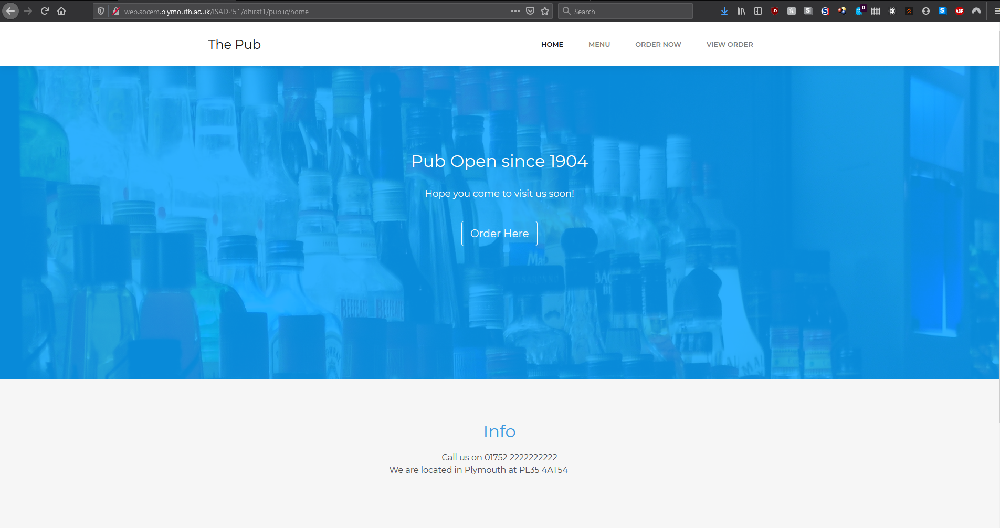
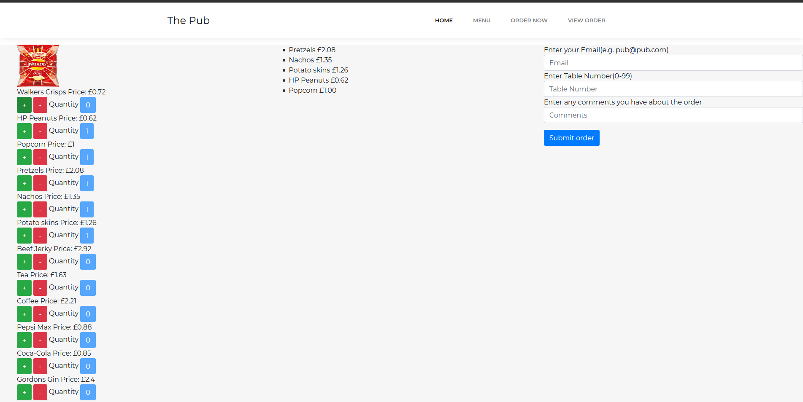
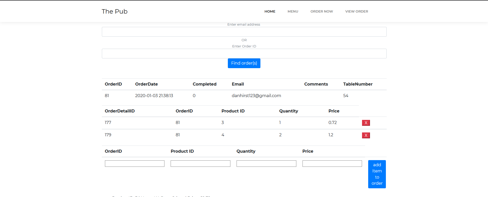
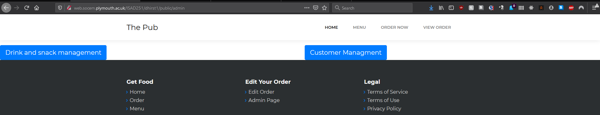
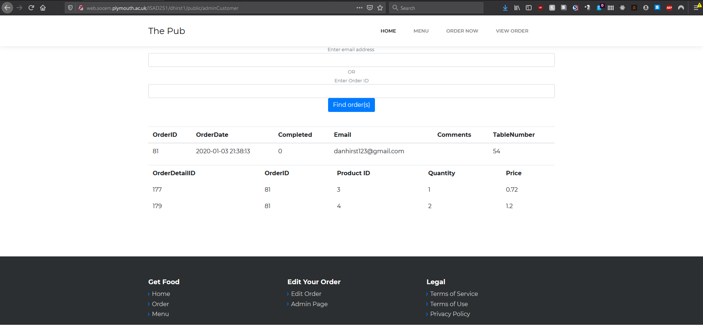
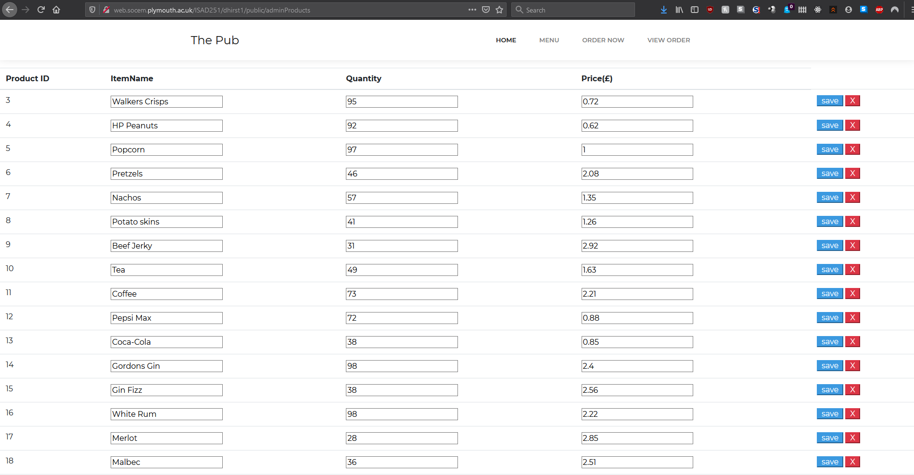

# ISAD251---Coursework

## Dependencies:
- https://getcomposer.org/download/ for Laravel 
- follow steps to install Laravel: https://laravel.com/docs/6.x/installation

### To install project:
- git clone {insert project clone}
- "composer update" in pub-site folder
- composer install
- php artisan key:generate
- php artisan serve

### Tools used:
- Laravel 6.5: https://laravel.com/
- Postman (To test API): https://www.getpostman.com/
- Mockaroo (to help create fake data): https://mockaroo.com/
- Bootstrap Studio (to help create the first layout): https://bootstrapstudio.io/ 
- Regex helper(to help with the regex for email): https://www.regextester.com/ 
- Composer (used to install dependencies for Laravel): https://getcomposer.org/download/
- Web accessibility test: https://achecker.ca/ 

## Video Showing the program:

https://www.youtube.com/watch?v=cmFHNDcs7jY<VIDEO ID>

## Images used:
- Bottles on homepage https://www.freeimages.com/photo/bottle-1528364
- walkers crisp https://walkers.co.uk/crisps-range/walkers-crisps/ready-salted

## Screenshots
### Home

### Add order

### View order

### Admin

### Admin customer

### Admin products

## Application fact sheet
### Customer orders snack
    1.	On the home page click order here on the image or order now on the tool bar
    2.	On the order page click the items you want on the left-hand side using + and –
    3.	type in a valid Email (this is validated by regex) on the right-hand side
    4.	type in a table number between 1-99
    5.	the comments are optional
    6.	Once filled in click the submit order button
    7.	If the email and/or table number is incorrect the program will prompt you 
    8.	if all the elements are correct the program will redirect you to a page that has all the order details including order ID, products and the total.
### Customer views/adds/removes order
#### View order
    1.	On the home page click the “View Order” text at the top of the screen
    2.	To view your order either type in the Order ID or the Email
#### Add item to order ( follow steps in view order first)
    3.	To add an item to your order you type in the OrderID, ProductID, Quantity and price in the boxes at the bottom
    4.	Once all the details are correct click the "add item to order" button
    5.	Repeat step 2 to view order
#### Remove item in order ( follow steps in view order first)
    3.	To remove an item, click the red cross next to the item in the table to remove
    4.	Repeat step 2 to view order

### Admin views order  
    1.	On the home page click the “Admin Page” text at the footer under edit your order
    2.	On the admin page click the button “Customer Management”
    3.	To view the order either type in the Order ID or the Email
### Admin views/edits/adds/removes products
#### Admin views product
    1.	On the home page click the “Admin Page” text at the footer under edit your order
    2.	On the admin page click the button “Drink and snack management”
    3.	Listed are the products in their respected rows
#### Admin edits product (Follow steps 1-3 in admin view product first)
    4.	To edit a product replace any text in a row such as change "walkers crisps" to "walkers ready salted" and the quantity to 94
    5.	Once a row has been changed you must press that rows save button to save to the database
    6.	Once the product has been saved the page should refresh and show your changes
#### Admin adds a product (Follow steps 1-3 in admin view product first)
    4.	To add a product scroll to the bottom of the page
    5.	Enter the product name, quantity and price then tick the box if it is a food item
    6.	Once all the fields are filled in click the "add item" button to save the product to the database
    7.	This will refresh the page and show the new product at the bottom of the list
#### Admin removes a product (Follow steps 1-3 in admin view product first)
    4.	To remove an item in a row, click the red X next to that row
    5.	Once the product has been removed from the database the page will refresh with the product missing

## Browsers Compatibility
### Browsers that have been tested:
- Firefox
- Chrome
- Edge
### Browser that aren’t compatible that have been tested:
- Internet Explorer
